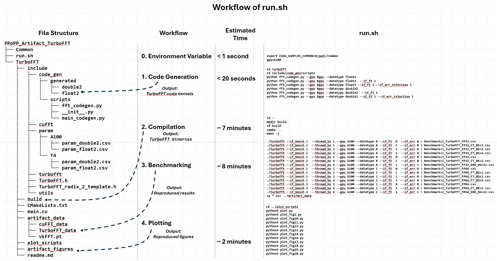
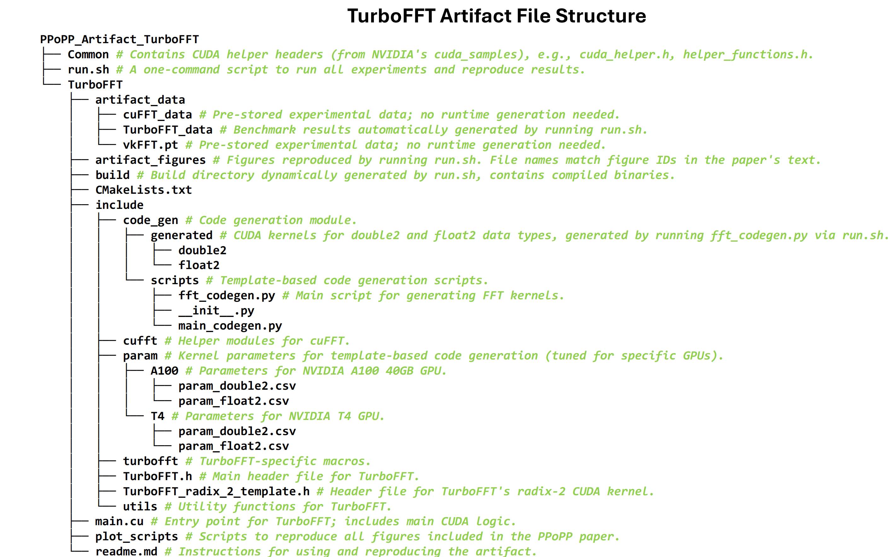

# TurboFFT Artifact

This repository contains the artifact for TurboFFT, enabling the reproduction of experimental results presented in our paper. The **one-command script** `run.sh` allows you to regenerate **11 experimental result figures** on NVIDIA A100 GPUs (Figures 1, 10-14, and 16-20). The **remaining 3 figures** on NVIDIA T4 GPUs (mentioned in the paper) are under testing and will be updated by **11/24 evening**.

## Workflow Overview



The script `run.sh` executes the following steps:
1. **Environment Setup**: Configures environment variables.
2. **Code Generation**: Generates required CUDA kernels.
3. **Compilation**: Builds TurboFFT and related binaries.
4. **Benchmarking**: Runs benchmarks for TurboFFT.
5. **Plotting**: Produces figures matching the paper's results.

The entire process takes approximately **15-20 minutes** on a machine with an **AMD EPYC 7763 64-Core Processor** and a **NVIDIA A100 40GB GPU**.

## Included Data

- **Pre-stored Results**: Results for **cuFFT**, **VkFFT**, and **offline_FFT** are pre-stored in CSV format within the `artifact_data` directory. These results can be used directly without additional benchmarking.
- **TurboFFT Results**: Benchmark results for TurboFFT are generated during the `run.sh` execution.

If reviewers wish to test cuFFT, VkFFT, or offline_FFT, we are happy to provide detailed testing instructions upon request.

## Software Requirements

To successfully run this artifact, ensure the following dependencies are installed:

### System Requirements
- **GPU**: NVIDIA A100 40GB (or equivalent for benchmarking TurboFFT).
- **CPU**: AMD EPYC 7763 64-Core Processor (or equivalent).

### Software Dependencies
- **CUDA Toolkit**: `12.0`
- **Python**: `3.10` with the following packages:
  - `seaborn` `0.13.2`
  - `matplotlib` `3.8.4`
  - `torch` `2.4.1`
  - `numpy` `2.1.3`
- **CMake**: `3.24.3`

## How to Use

1. **Clone the repository**:
   ```bash
   git clone https://github.com/shixun404/PPoPP25_Artifact_TurboFFT
   cd PPoPP25_Artifact_TurboFFT
   ```

2. **Ensure all dependencies are installed** (see **Software Requirements**).

3. **Run the script**:
   ```bash
   ./run.sh
   ```

4. **View results**:
   - Experimental data will be available in the `artifact_data` directory.
   - Figures will be saved in the `artifact_figures` directory.

## Directory Structure



## Notes for Reviewers

- Figures generated using `run.sh` match **Figures 1, 10-14, and 16-20** from the paper.
- Results for **cuFFT**, **VkFFT**, and **offline_FFT** are stored as CSV files in `artifact_data`.
- Results on NVIDIA T4 GPUs will be updated by **11/24 evening**.
- If additional testing is desired, we are available to provide guidance or scripts upon request.

## Contact

If you encounter any issues or have questions regarding the artifact, please feel free to contact us. Thank you for reviewing our work!